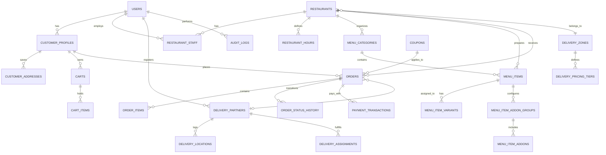
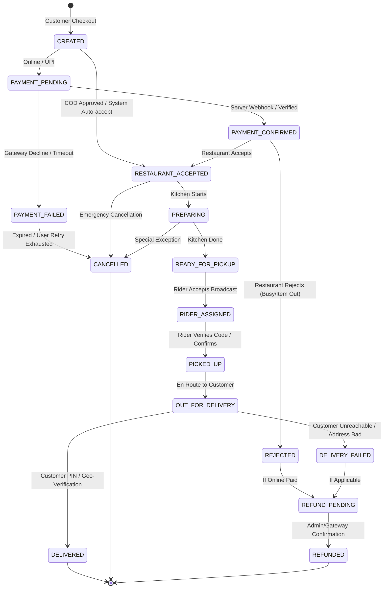

# Aajori Cuisine - Master Architecture & System Design Blueprint

## 1. System Overview & Context
**Aajori Cuisine** is an AI-native hyperlocal food-commerce and delivery infrastructure platform designed for district-scale operations (initially targeting a district in Assam, India such as Kamrup / Jorhat / Dibrugarh / Nagaon). It is engineered as a unified commerce platform serving multiple interfaces through a single source-of-truth backend:

1. **Customer Flutter App** (Android / iOS)
2. **Delivery Partner Flutter App** (Android / iOS)
3. **Restaurant Partner Portal** (Responsive Web)
4. **Super Admin Operations Control Center** (Responsive Web + Live GIS)
5. **WhatsApp Conversational Ordering Engine** (Webhook + NLP/AI + Shared Commerce API)
6. **AI Food Assistant** (Multi-turn preference resolver)
7. **MCP (Model Context Protocol) Server** (Standardized tools for Claude, ChatGPT, Gemini agents)

---

## 2. Monorepo Repository Structure

```text
aajori-cuisine/
├── backend/                           # Node.js/TypeScript Modular Monolith (Vercel & Node compatible)
│   ├── src/
│   │   ├── config/                    # Environment, constants, database clients
│   │   ├── modules/
│   │   │   ├── auth/                  # Supabase JWT verify, OTP, RBAC guards
│   │   │   ├── users/                 # Profiles, addresses, staff associations
│   │   │   ├── restaurants/           # CRUD, operating hours, geofences, commissions
│   │   │   ├── menus/                 # Categories, items, variants, add-ons, availability
│   │   │   ├── pricing/               # Deterministic pricing engine, rules, fee calculator
│   │   │   ├── cart/                  # Multi-item cart validator, restaurant isolation
│   │   │   ├── orders/                # Order creation, state machine, transitions, audit
│   │   │   ├── delivery/              # Zone evaluation (PostGIS), rider assignments, tracking
│   │   │   ├── payments/              # Payment abstraction (UPI, Cash, Gateway stubs/webhooks)
│   │   │   ├── promotions/            # Coupons, flat discounts, validation
│   │   │   ├── notifications/         # Multi-channel dispatcher (FCM, WhatsApp, Webhook)
│   │   │   ├── search/                # PostGIS & pg_trgm full-text food & restaurant search
│   │   │   ├── analytics/             # District sales, restaurant & rider operational KPIs
│   │   │   ├── ai/                    # Intent parser, preference extractor, suggestion engine
│   │   │   ├── mcp/                   # Model Context Protocol stdio/HTTP server implementation
│   │   │   ├── whatsapp/              # Meta WhatsApp Cloud API webhooks & stateful chatbot
│   │   │   └── admin/                 # Control center operations, audit logs, overrides
│   │   ├── middleware/                # Auth, RBAC, idempotency, rate-limit, error handler
│   │   ├── common/                    # Result types, errors, utilities, math, geo utils
│   │   └── server.ts                  # Express / Fastify / Vercel Serverless entrypoint
│   ├── package.json
│   ├── tsconfig.json
│   └── tests/                         # Unit & integration tests for pricing, state machine, RBAC
│
├── database/                          # Supabase PostgreSQL + PostGIS Migrations & Seeds
│   ├── migrations/
│   │   ├── 001_initial_schema.sql     # Tables, types, constraints, PostGIS extensions
│   │   ├── 002_rls_policies.sql       # Fine-grained Row Level Security
│   │   ├── 003_functions_triggers.sql # Spatial triggers, order history logger, timestamps
│   │   └── 004_indexes.sql            # Spatial indexes (GIST), search indexes (GIN/trgm)
│   └── seeds/
│       └── 001_district_seed.sql      # Seed data: 3 Assam restaurants, menus, zones, riders, orders
│
├── admin_panel/                       # Super Admin Operations Control Center & Restaurant Portal
│   ├── src/
│   │   ├── components/                # UI kit, Live MapLibre/Leaflet map, Order lifecycle viewer
│   │   ├── pages/                     # Dashboard, Orders, Restaurants, Delivery, Analytics, Audit
│   │   ├── services/                  # Backend API client, Supabase Realtime client
│   │   └── store/                     # Auth & operational state
│   ├── package.json
│   └── vite.config.ts                 # Fast Vite + React + Tailwind + Lucide icons
│
├── customer_app/                      # Native Flutter Mobile Application (Customer)
│   ├── lib/
│   │   ├── core/                      # Theme, router, network client, local storage, location
│   │   ├── features/
│   │   │   ├── auth/                  # Phone OTP login, profile setup
│   │   │   ├── home/                  # District discovery, categories, banners, AI assistant fab
│   │   │   ├── restaurant/            # Menu viewer, item customizations, add-ons
│   │   │   ├── cart/                  # Realtime cart sync, backend price breakdown
│   │   │   ├── checkout/              # Address selector, payment choice, order dispatch
│   │   │   ├── orders/                # Order status timeline, live tracking map
│   │   │   └── ai_assistant/          # Conversational meal planner & direct cart additions
│   │   └── main.dart
│   └── pubspec.yaml
│
├── delivery_app/                      # Native Flutter Mobile Application (Delivery Partner)
│   ├── lib/
│   │   ├── core/                      # Location tracking service (battery-efficient), network
│   │   ├── features/
│   │   │   ├── auth/                  # Rider login & verification
│   │   │   ├── shift/                 # Online/Offline toggle, zone indicator
│   │   │   ├── orders/                # Incoming broadcast, Accept/Reject, Pickup & Deliver workflow
│   │   │   ├── map/                   # Turn-by-turn routing to Restaurant & Customer
│   │   │   └── earnings/              # Daily/weekly ledger, payout summaries
│   │   └── main.dart
│   └── pubspec.yaml
│
└── docs/                              # Project Documentation
    ├── ARCHITECTURE.md
    ├── DATABASE.md
    ├── API.md
    ├── PRICING_ENGINE.md
    ├── STATE_MACHINE.md
    ├── MCP.md
    ├── WHATSAPP.md
    └── DEPLOYMENT.md
```

---

## 3. Database Entity Relationship Diagram (PostgreSQL + PostGIS)



### Key Table Schemas

1. **`users` & `profiles`**:
   - `id UUID PRIMARY KEY REFERENCES auth.users(id)`
   - `phone TEXT UNIQUE`, `email TEXT`, `role user_role ENUM('SUPER_ADMIN', 'ADMIN', 'RESTAURANT_OWNER', 'RESTAURANT_MANAGER', 'DELIVERY_PARTNER', 'CUSTOMER')`
   - `full_name TEXT`, `status account_status ENUM('PENDING', 'ACTIVE', 'SUSPENDED')`

2. **`restaurants`**:
   - `id UUID PRIMARY KEY`, `name TEXT`, `slug TEXT UNIQUE`, `description TEXT`
   - `phone TEXT`, `email TEXT`, `location GEOGRAPHY(POINT, 4326)` (PostGIS point: lon, lat)
   - `address_line TEXT`, `city TEXT`, `district TEXT DEFAULT 'Kamrup'`, `postal_code TEXT`
   - `is_active BOOLEAN`, `is_accepting_orders BOOLEAN`
   - `commission_rate NUMERIC(5,2) DEFAULT 12.00`
   - `avg_prep_time_minutes INT DEFAULT 20`, `min_order_amount NUMERIC(10,2) DEFAULT 100.00`
   - `logo_url TEXT`, `cover_url TEXT`

3. **`menu_items` & variants/addons**:
   - `id UUID PRIMARY KEY`, `restaurant_id UUID REFERENCES restaurants(id)`
   - `category_id UUID REFERENCES menu_categories(id)`
   - `name TEXT`, `description TEXT`, `price NUMERIC(10,2)`
   - `is_veg BOOLEAN`, `is_available BOOLEAN`, `image_url TEXT`, `prep_time_minutes INT`

4. **`delivery_zones` & `delivery_pricing_tiers`**:
   - `id UUID PRIMARY KEY`, `name TEXT`, `district TEXT`
   - `boundary GEOMETRY(POLYGON, 4326)`, `center_point GEOGRAPHY(POINT, 4326)`
   - `base_radius_km NUMERIC(5,2)`, `base_fee NUMERIC(10,2)`
   - `per_km_fee NUMERIC(10,2)`, `max_delivery_radius_km NUMERIC(5,2)`

5. **`orders`**:
   - `id UUID PRIMARY KEY DEFAULT gen_random_uuid()`
   - `display_order_id TEXT UNIQUE` (e.g. `AJR-2026-1001`)
   - `customer_id UUID REFERENCES users(id)`
   - `restaurant_id UUID REFERENCES restaurants(id)`
   - `delivery_partner_id UUID REFERENCES delivery_partners(id) NULL`
   - `delivery_address JSONB` (immutable snapshot of delivery address, coordinates, instructions)
   - `order_status order_status_enum`
   - `payment_status payment_status_enum`
   - `payment_method payment_method_enum` ('UPI', 'ONLINE', 'COD')
   - `subtotal NUMERIC(10,2)`, `packaging_fee NUMERIC(10,2)`, `delivery_fee NUMERIC(10,2)`
   - `platform_fee NUMERIC(10,2)`, `taxes NUMERIC(10,2)`, `discount_amount NUMERIC(10,2)`
   - `total_customer_price NUMERIC(10,2)`
   - `restaurant_commission_amount NUMERIC(10,2)`, `rider_earnings_amount NUMERIC(10,2)`
   - `pricing_breakdown_snapshot JSONB` (exact calculation record)
   - `idempotency_key TEXT UNIQUE`
   - `created_at TIMESTAMPTZ`, `updated_at TIMESTAMPTZ`

6. **`order_items`**:
   - `id UUID PRIMARY KEY`, `order_id UUID REFERENCES orders(id)`
   - `menu_item_id UUID`, `item_name TEXT`
   - `unit_price NUMERIC(10,2)` (historical snapshot)
   - `quantity INT`, `variant_snapshot JSONB`, `addons_snapshot JSONB`
   - `subtotal NUMERIC(10,2)`

7. **`order_status_history`**:
   - `id UUID PRIMARY KEY DEFAULT gen_random_uuid()`
   - `order_id UUID REFERENCES orders(id)`
   - `previous_status order_status_enum`
   - `new_status order_status_enum`
   - `actor_id UUID REFERENCES users(id) NULL`
   - `actor_role TEXT` ('CUSTOMER', 'RESTAURANT', 'DELIVERY_PARTNER', 'SUPER_ADMIN', 'SYSTEM')
   - `reason TEXT NULL`, `metadata JSONB NULL`, `created_at TIMESTAMPTZ DEFAULT now()`

---

## 4. Order State Machine



### Strict Transition Validation Matrix
| From Status | Allowed Next Statuses | Allowed Roles |
| :--- | :--- | :--- |
| `CREATED` | `PAYMENT_PENDING`, `PAYMENT_CONFIRMED`, `CANCELLED` | `CUSTOMER`, `SYSTEM` |
| `PAYMENT_PENDING` | `PAYMENT_CONFIRMED`, `PAYMENT_FAILED`, `CANCELLED` | `SYSTEM`, `ADMIN` |
| `PAYMENT_CONFIRMED`| `RESTAURANT_ACCEPTED`, `REJECTED`, `CANCELLED` | `RESTAURANT`, `ADMIN`, `SYSTEM` |
| `RESTAURANT_ACCEPTED`| `PREPARING`, `CANCELLED` | `RESTAURANT`, `ADMIN` |
| `PREPARING` | `READY_FOR_PICKUP`, `CANCELLED` | `RESTAURANT`, `ADMIN` |
| `READY_FOR_PICKUP` | `RIDER_ASSIGNED`, `CANCELLED` | `DELIVERY_PARTNER`, `ADMIN`, `SYSTEM` |
| `RIDER_ASSIGNED` | `PICKED_UP`, `READY_FOR_PICKUP` (Reassign) | `DELIVERY_PARTNER`, `ADMIN` |
| `PICKED_UP` | `OUT_FOR_DELIVERY` | `DELIVERY_PARTNER` |
| `OUT_FOR_DELIVERY`| `DELIVERED`, `DELIVERY_FAILED` | `DELIVERY_PARTNER`, `ADMIN` |
| `REJECTED` | `REFUND_PENDING`, `CANCELLED` | `SYSTEM`, `ADMIN` |
| `DELIVERY_FAILED`| `REFUND_PENDING`, `CANCELLED` | `ADMIN`, `SYSTEM` |
| `REFUND_PENDING` | `REFUNDED` | `ADMIN`, `SYSTEM` |

---

## 5. Pricing Engine Specification

Authoritative pricing calculations occur strictly in `backend/src/modules/pricing/pricing.service.ts`.

$$ \text{Total Customer Price} = \text{Item Subtotal} + \text{Packaging Fee} + \text{Delivery Fee} + \text{Platform Fee} + \text{Taxes} - \text{Discounts} - \text{Coupon} $$

Where:
1. **Item Subtotal**: $\sum (\text{item.price} + \sum \text{addon.price}) \times \text{quantity}$
2. **Packaging Fee**: Flat restaurant packaging fee (e.g. ₹15 - ₹25) or per-item tier.
3. **Delivery Fee**: Calculated using PostGIS distance $d$ between Restaurant coordinate and Customer coordinate:
   - If $d \le 3\text{ km}$: Base fee $B = ₹20$
   - If $3 < d \le 5\text{ km}$: $B + (d - 3) \times ₹7.5 = ₹35$
   - If $5 < d \le 8\text{ km}$: $₹35 + (d - 5) \times ₹5 = ₹50$
   - If $d > \text{max\_radius}$ (e.g. 10 km): Order rejected (`NOT_SERVICEABLE`).
4. **Platform Fee**: Flat district maintenance fee (e.g. ₹5.00).
5. **Taxes (GST)**: 5% on restaurant food services in India.
6. **Coupon & Discount Engine**: Server validates expiry, min spend, district restrictions, single-use per customer.

---

## 6. Role-Based Access Control (RBAC) Matrix

| Resource / Action | Customer | Delivery Partner | Restaurant Staff | Admin / Super Admin |
| :--- | :---: | :---: | :---: | :---: |
| Browse Restaurants & Menus | Read | Read | Read | Read |
| Place Order / Modify Cart | Own | No | No | Read / Override |
| View Order Details | Own Orders | Assigned Orders | Restaurant Orders | All Orders |
| Transition Order Status | Cancel (Before Accept) | Pickup, Deliver | Accept, Prep, Ready | Full Lifecycle Override |
| Manage Menu & Store Hours | No | No | Own Restaurant | All Restaurants |
| Toggle Online / Availability | N/A | Own Status | Own Restaurant | Admin Override |
| Access Financial Ledger / Reports | Own Receipts | Own Earnings | Own Settlement | District Financial Ledger |
| System Configuration & Zones | No | No | No | Full Management |

---

## 7. Operational Information Architecture (Super Admin Control Center)

```text
Super Admin Operational Control Center
├── 1. Overview Dashboard
│   ├── Real-time District Metric Badges (Active orders, online riders, today's gross/net sales)
│   ├── Live Order Velocity & Heatmaps
│   └── Urgent Attention Alerts (Delayed pickup > 15m, payment dispute, offline restaurant)
├── 2. Live Operations GIS Map
│   ├── PostGIS-rendered Delivery Zones & Serviceability Polygons
│   ├── Real-time GPS Pins of Online Delivery Partners
│   └── Live Restaurant Markers & In-Transit Active Orders
├── 3. Order Management Control Center
│   ├── Multi-filter Order Pipeline (Created -> Accepted -> Preparing -> Ready -> Transit -> Delivered)
│   ├── Deep Lifecycle Inspector with Timestamps & Actor Audit
│   └── Manual Dispatch & Rider Reassignment Tools
├── 4. Restaurant Partner Management
│   ├── Onboarding & KYC Approval Workflow
│   ├── Commission Rate & Fee Configurator (Per-restaurant custom % or flat)
│   └── Geofence & Service Radius Assignment
├── 5. Delivery Partner Operations
│   ├── Verification & Document Approval
│   ├── Shift Monitor & Battery/Location Health
│   └── Weekly Settlement & Payout Ledger
├── 6. Pricing, Zones & Promotions
│   ├── Polygon & Distance Fee Matrix Editor
│   └── Dynamic District Discount & Coupon Creator
├── 7. WhatsApp & AI Audit Hub
│   ├── Conversation Transcript Inspector
│   └── Intent Classifier Accuracy & Unresolved Query Escalations
└── 8. Enterprise Audit Logs
    └── Immutable Trail of all Admin & Staff Overrides (Who, What, When, IP, Diff)
```

---

## 8. External Integrations & Fallbacks (Credentials Matrix)

| Service | Primary Provider | Integration Pattern | Fallback / Stub Strategy |
| :--- | :--- | :--- | :--- |
| **Database & Auth** | Supabase (PostgreSQL + PostGIS) | Direct connection / REST | Local PostgreSQL + PostGIS connection string |
| **Realtime Updates** | Supabase Realtime | WebSocket channel subscriptions | Polling / SSE fallback emitter |
| **Object Storage** | Supabase Storage | S3-compatible signed URLs | Local filesystem public storage provider |
| **Payments** | Razorpay / Cashfree / PhonePe UPI | Server-to-server webhook + signature | Idempotent Mock Gateway with test UPI/Cash flow |
| **Push Notifications**| Firebase Cloud Messaging (FCM) | Server SDK topic & device broadcast | In-app notification queue + console logger |
| **WhatsApp Business**| Meta Cloud API v20.0 | Webhook receiver + Send Message API | WhatsApp Simulator UI & Interactive Webhook Sandbox |
| **AI Meal Assistant** | Gemini 1.5 / Claude / OpenAI | Structured Function Calling / JSON mode | Rule-based semantic keyword & budget parser |
| **Maps & Routing** | MapLibre GL / OpenStreetMap / OSRM | Vector tiles + PostGIS ST_DistanceSphere | Built-in Haversine/Vincenty PostGIS fallback |
